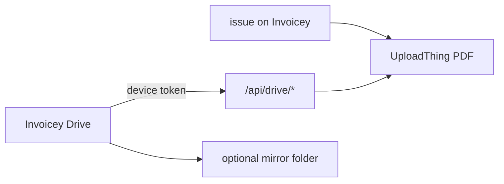

<p align="center">
  <a href="https://invoicey.app">
    
  </a>
</p>

<h1 align="center">Invoicey Drive</h1>

<p align="center">
  <strong>Issued invoices as files in Finder.</strong> The website stays the product.
</p>

<p align="center">
  Pair a Mac. Invoicey Drive lists issued PDFs in a workspace / issuer tree, keeps an optional mirror folder in sync, and colors files the same way the website does. Cancel, pay, and issue stay on Invoicey.
</p>

<p align="center">
  <a href="https://github.com/filipditrich/invoicey-mac/releases/latest/download/InvoiceyDrive.dmg"></a>
  <a href="https://invoicey.app"></a>
  <a href="https://invoicey.app/docs/integrations/invoicey-drive"></a>
  <a href="https://github.com/filipditrich/inveoiceyai"></a>
  
</p>

<p align="center">
  <a href="#install">Install</a> ·
  <a href="#how-it-works">How it works</a> ·
  <a href="#what-you-get">What you get</a> ·
  <a href="#pair-this-mac">Pair this Mac</a> ·
  <a href="#documentation">Docs</a> ·
  <a href="https://invoicey.app/brand">Brand</a> ·
  <a href="#license">License</a>
</p>

---

## Install

Download the notarized [InvoiceyDrive.dmg](https://github.com/filipditrich/invoicey-mac/releases/latest/download/InvoiceyDrive.dmg), drag **Invoicey Drive** into Applications, then open it from there. Pairing starts in the Mac app. Settings on Invoicey lists devices and can revoke them.

`swift run` is for local development (mirror folder only). Finder Locations needs the signed `.app`.

---

## How it works

Invoicey Drive is a **librarian**, not a second Invoicey. The Swift app lives here. Pairing, the index, artifact bytes, Settings, and product docs live in the sibling turborepo [`filipditrich/inveoiceyai`](https://github.com/filipditrich/inveoiceyai).



The Mac polls `GET /api/drive/index`, then materializes:

```text
Invoicey Drive/
  {workspace}/
    {issuer}/
      2026/faktura_2026001.pdf
```

Layout comes from the server (`{year}/{kind}_{number}` by default). Identity is invoice id, not the path. Finder delete is local; the next sync restores the file. Drop-ins are ignored. Cancel only on the website.

---

## What you get

| Capability | Detail |
| ---------- | ------ |
| **Finder tree** | Workspace then issuer then the layout template. Drafts never appear. Cancelled invoices leave the tree. Native issued invoices without a stored PDF still sync (rendered on download). Imports without a PDF stay omitted. |
| **Color labels** | Same `displayStatus` as the website: green paid, orange unpaid or not yet due, red overdue. Finder **tags** plus the classic label number. Status is not in the filename. Proton/iCloud often drop tags. |
| **Optional mirror** | iCloud, Proton Drive, or a local `_faktury` folder. Same relative paths as the index. |
| **Pairing** | Starts in the Mac app (PKCE). Confirm **Connect this Mac** on Invoicey. Device token in Keychain. Not a Settings PAT. |
| **Menu bar** | Invoicey I monogram (template, follows the system). Version, last sync, and overdue/unpaid counts in the menu. Sync now, open Locations, optional mirror, sign out. Check for Updates once a day and from the menu. Polls every 60s and on wake. |
| **macOS 14+** | Distributed as a notarized `.dmg`. Not the Mac App Store. |

Finder Locations (a real **Invoicey Drive** domain next to Proton Drive) ships from `InvoiceyDrive.xcodeproj` (app `me.ditrich.invoicey.drive` + File Provider `me.ditrich.invoicey.drive.provider`, Team `72T6DX5YZU`). `swift run` is the mirror folder only.

---

## Pair this Mac

1. Run Invoicey ([local](https://github.com/filipditrich/inveoiceyai#local-development) or [invoicey.app](https://invoicey.app)).
2. From this repo: `swift run invoicey-drive pair` (or the menu bar extra).
3. Sign in if needed. Click **Connect this Mac**.
4. `swift run invoicey-drive sync` writes `~/Invoicey Drive` unless you already set a folder.

Pairing always starts here. Invoicey Settings lists devices and can revoke them. It does not start a new connect session.

```bash
git clone https://github.com/filipditrich/invoicey-mac.git
cd invoicey-mac

# local Invoicey on :3000
INVOICEY_DRIVE_API_URL=http://localhost:3000 swift run invoicey-drive pair
INVOICEY_DRIVE_API_URL=http://localhost:3000 swift run invoicey-drive sync

# production
INVOICEY_DRIVE_API_URL=https://invoicey.app swift run invoicey-drive pair
```

Never paste a PAT. `swift run` uses a loopback callback (`http://127.0.0.1:<port>/oauth`). The signed app uses Associated Domains (`https://invoicey.app/drive/oauth`) and `invoicey-drive://oauth`.

---

## Documentation

| Doc | What it covers |
| --- | -------------- |
| [Invoicey Drive guide](https://invoicey.app/docs/integrations/invoicey-drive) | Install, tokens, iCloud vs Invoicey Drive |
| [Invoicey brand](https://invoicey.app/brand) | Compact mark and full wordmark |
| [Invoicey](https://github.com/filipditrich/inveoiceyai) | Product, web, MCP, Slack, Drive API |
| [Account Settings](https://invoicey.app/settings/account/drive) | Layout template, devices, download |
| [`Sources/FileProvider/README.md`](Sources/FileProvider/README.md) | File Provider enumerator vs the signed Xcode project |

---

## Stack

Swift 6 · macOS 14 · menu bar extra · CLI · File Provider appex (`InvoiceyDrive.xcodeproj`). Bundle id `me.ditrich.invoicey.drive`.

<details>
<summary>Repo map</summary>

```text
Sources/InvoiceyDriveCore/     Pairing, index client, mirror sync, Finder labels
Sources/InvoiceyDrive/         Menu bar extra
Sources/InvoiceyDriveCLI/      invoicey-drive pair | sync | status | sign-out
Sources/FileProvider/          Enumerator + item identity
Tests/InvoiceyDriveCoreTests/
```

</details>

<details>
<summary>Local development</summary>

Contributor workflow. Production pairing talks to [invoicey.app](https://invoicey.app). Clone and run the web app from [`inveoiceyai`](https://github.com/filipditrich/inveoiceyai) when you need a local API. Open `InvoiceyDrive.xcodeproj` to run the signed app + Finder domain
(`xcodegen generate` if you edit `project.yml`). Xcode → Settings → Accounts
must include team `72T6DX5YZU`. Import the Developer ID identity from
`~/.invoicey/apple/` into the login Keychain before Archive / notarize.
`scripts/render-brand-icons.sh` rebuilds the App Icon and DMG background from
`docs/assets/brand`. `scripts/package-dmg.sh` lays out the drag-to-Applications
disk image.

```bash
swift test
swift run invoicey-drive status
swift run InvoiceyDrive
```

Default web origin is `http://localhost:3000` (`INVOICEY_DRIVE_API_URL`).

Keychain service `me.ditrich.invoicey.drive`, account `device-token`. If Keychain save fails (unsigned `swift run`), the token is written to `~/Library/Application Support/Invoicey Drive/debug-token` with mode `0600`. Config (`config.json`) never stores the token. Sign out calls `POST /api/drive/revoke`.

Login item default on applies only inside a bundled app (`SMAppService`).

</details>

<details>
<summary>Drive API</summary>

Owned by Invoicey (`apps/web`). This repo is a client.

| Step | Request |
| --- | --- |
| Connect page | `GET {api}/drive/connect?challenge={S256}&redirect={url}&device={name}` |
| Token | `POST {api}/api/drive/token` `{ code, verifier, redirectUri }` |
| Latest | `GET {api}/api/drive/latest` `{ version, dmgUrl }` (no token) |
| Index | `GET {api}/api/drive/index` `Authorization: Bearer {token}` |
| PDF | `GET {api}/api/drive/invoices/{id}/pdf` |
| ISDOC | `GET {api}/api/drive/invoices/{id}/isdoc` |
| Revoke | `POST {api}/api/drive/revoke` |

Redirect allowlist (web): `invoicey-drive://oauth`, `http://127.0.0.1:*/oauth`, `http://localhost:*/oauth`, `https://invoicey.app/drive/oauth`.

</details>

---

## License

Source-available during private beta, same as [Invoicey](https://github.com/filipditrich/inveoiceyai). A public license lands when the product is generally available.
